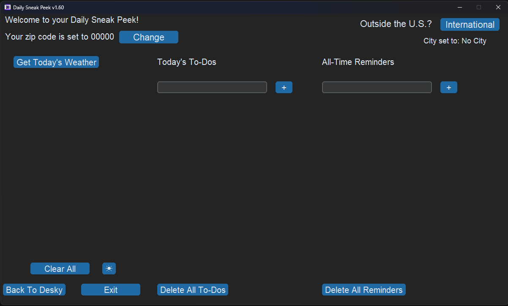
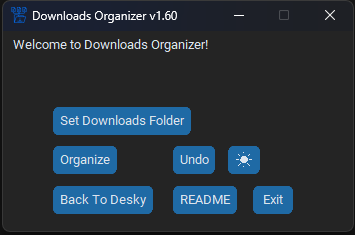
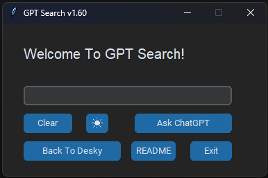
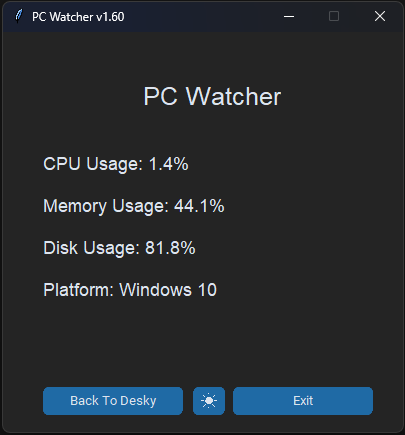
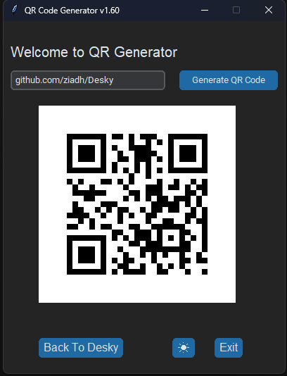
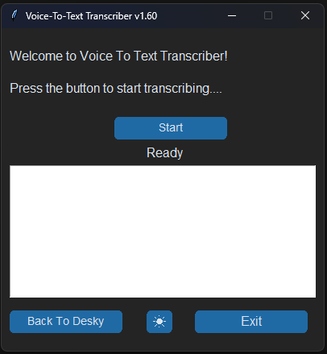

<h1> Desky</h1>

[![Downloads][downloads-shield]][downloads-url]
[![License][license-shield]][license-url]
[![Language][language-shield]][language-url]
[](https://github.com/ziadh/Desky/releases)</p>

## Table of Contents
- [About Desky](#about)
- [How to Install](#how-to-install)
- [Downloads Folder Organizer](#downloads-folder-organizer)
- [Youtube Downloader](#youtube-downloader)
- [Fresh Desktop Check List](#fresh-desktop-check-list)
- [Your Daily Sneak Peek](#daily-sneak-peek)
- [Word2PDF Converter](#word2pdf-converter)
- [Tock Tick](#tock-tick)
- [Voice 2 TXT Transcriber](#voice-2-txt-transcriber)

<h2>Your daily one-stop shop desktop companion with a versatile list of useful tools.</h2>

## How to Install 

- Download [Python](https://www.python.org/downloads/) from here
- Download the [source file](https://github.com/ziadh/Desky/archive/refs/heads/main.zip) from here
- After unzipping the source file and navigating to where the main.py file is located, press on the address bar as shown below then type cmd.


Run the following command to download all the required packages

```
pip install -r requirements.txt
```

When it is finished, close the cmd and simply double click the Safe-Data.pyw file or the .exe file.


## About  
Desky contains a plenty of mini-applications™ that aims to make your everyday life a little easier. New mini-apps will be added with every update. Updates usually go out every Tuesday or Wednesday mornings EST. 

# Daily Sneak Peek:


 Stay up to date with your day.
 It now supports internation cities!


<!--  -->


# Downloads Folder Organizer
## Got your Downloads folder a big mess? This mini-app will fix it for you in ~~one~~ TWO clicks.



# Fresh Desktop Check List
## Recently reset your desktop or would just want to download the newest versions of these popular free programs? This tool will get you caught up with all the desktop apps that you need!


# Quick Google Search
## Get your quick Google search in with this handy mini-app.  


### It does not track or save your queries


# Chat GPT Quick Search
## Got a question on your mind for Chat GPT that you want to ask right away? This mini-app launches your web browser and types in the query for you in one click! 




### It does not track or save your queries and it also requires that you're already logged in to OpenAI's ChatGPT


# My Notes

## Simple note taking application that will be updated with more features regularly in the near future!


# PC Watcher
## Think you might be running short on CPU or storage? PC Watcher got you covered!



# QR Generator
## This simple QR generator will generate a QR code for a message, link, or anything that your heart desires!

# Tock Tick
## 3-in-1 clock related miniapps


# Word2PDF Converter
## Self explanatory, quick mini-app that converts your word documents to PDF


# Voice 2 TXT Transcriber
## Transcribe voice messages for you when Windows dictation wouldn't


# Youtube Downloader
## Pretty self explanatory name, it will contain customizable options as far as the downloaded resolution goes.


[downloads-shield]: https://img.shields.io/github/downloads/ziadh/Desky/total?style=for-the-badge&logo=github
[downloads-url]: https://github.com/ziadh/Desky/releases/latest
[license-shield]: https://img.shields.io/github/license/ziadh/Desky?style=for-the-badge
[license-url]: https://github.com/ziadh/Desky/blob/main/LICENSE
[language-shield]: https://img.shields.io/github/languages/top/ziadh/Desky?logo=python&logoColor=yellow&style=for-the-badge
[language-url]: https://www.python.org/