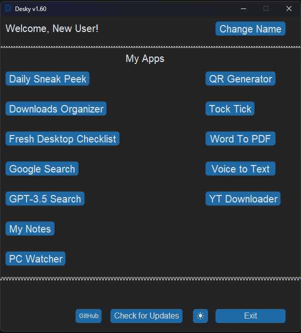
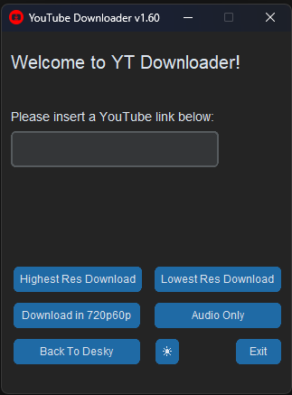
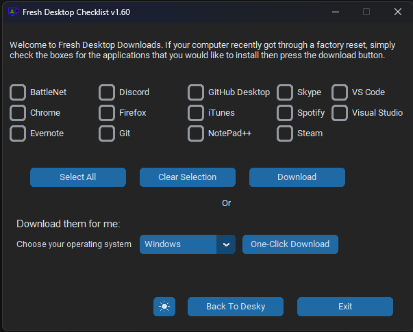

<h1> Desky</h1>

[![Downloads][downloads-shield]][downloads-url]
[![License][license-shield]][license-url]
[![Language][language-shield]][language-url]

## Table of Contents
- [About Desky](#about)
- [Downloads Folder Organizer](#downloads-folder-organizer)
- [Youtube Downloader](#youtube-downloader)
- [Fresh Desktop Check List](#fresh-desktop-check-list)
- [Your Daily Sneak Peek](#daily-sneak-peek)
- [Word2PDF Converter](#word2pdf-converter)
- [Known Issues](#known-issues)

<h2>Your daily one-stop shop desktop companion with a versatile list of useful tools.</h2>

## About  
Desky contains a plenty of mini-applications™ that aims to make your everyday life a little easier. New mini-apps will be added with every update. Updates usually go out every Tuesday or Wednesday mornings EST. 

# Daily Sneak Peek:

## Stay up to date with your day. Currently only shows today's weather for your zipcode, launch will include daily reminders as well as all-time To-Do list.
## Launch will also include support for intentional cities!

# Downloads Folder Organizer
## Got your Downloads folder a big mess? This mini-app will fix it for you in ~~one~~ TWO clicks.

# Youtube Downloader
## Pretty self explanatory name, it will contain customizable options as far as the downloaded resolution goes.

# Fresh Desktop Check List
## Recently reset your desktop or would just want to download the newest versions of these popular free programs? This tool will get you caught up with all the desktop apps that you need!

# Word2PDF Converter
## Self explanatory, quick mini-app that converts your word documents to PDF

# Known Issues:

-Will add edit/remove tasks and reminders in the near future

[downloads-shield]: https://img.shields.io/github/downloads/ziadh/Desky/total?style=for-the-badge&logo=github
[downloads-url]: https://github.com/ziadh/Desky/releases/latest
[license-shield]: https://img.shields.io/github/license/ziadh/Desky?style=for-the-badge
[license-url]: https://github.com/ziadh/Desky/blob/main/LICENSE
[language-shield]: https://img.shields.io/github/languages/top/ziadh/Desky?logo=python&logoColor=yellow&style=for-the-badge
[language-url]: https://www.python.org/